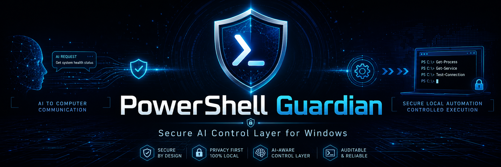
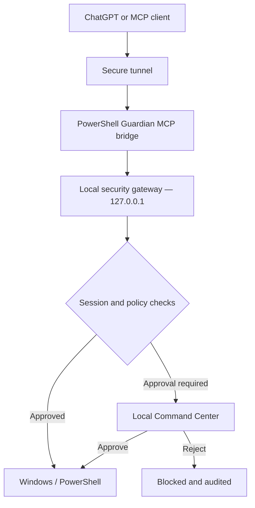

<div align="center">



# 🛡️ PowerShell Guardian

### A local security gateway for AI-assisted Windows automation

PowerShell Guardian connects ChatGPT and other MCP-compatible AI clients to Windows while keeping the user in control of every sensitive action.

[](https://github.com/CaptainVid/PowerShellGuardian/releases/latest)
[](#requirements)
[](#build-from-source)
[](LICENSE)
[](https://github.com/CaptainVid/PowerShellGuardian/stargazers)

[Download](https://github.com/CaptainVid/PowerShellGuardian/releases/latest) · [Build](#build-from-source) · [Security](SECURITY.md) · [Report a bug](https://github.com/CaptainVid/PowerShellGuardian/issues)

</div>

> [!IMPORTANT]
> PowerShell Guardian can execute administrative commands on your computer. Review commands before approving them, use the emergency lock when anything looks unexpected, and never publish your API key, Tunnel ID, session data, or diagnostic logs without reviewing them first.

## What is PowerShell Guardian?

PowerShell Guardian is an open-source, local-first control layer between an AI assistant and Windows. Instead of giving an AI unrestricted PowerShell access, it routes every request through a local gateway that validates the session, applies security policy, requests local approval when required, and records the decision in an audit log.

The core principle is simple:

> **AI can assist your computer, but you remain in control.**

The project is designed for users who want useful AI automation without removing the final human security boundary.

## Highlights

- **Local-first gateway** — listens only on `127.0.0.1`; approval decisions stay on the Windows computer.
- **Session approval** — every new AI session begins with a locally approved, device-bound session token.
- **Locked and unlocked modes** — choose strict approval for a session or allow routine operations to continue automatically.
- **Deletion protection** — deleting a file always requires explicit local approval, even in an unlocked session.
- **Creation-rate protection** — configurable limits apply only to new-file creation in unlocked sessions, never to reads or ordinary commands.
- **Safe path reading** — `read_path` performs bounded text reads and directory listings without invoking PowerShell.
- **Stable sessions** — lock/unlock changes preserve the same session ID and token instead of forcing a new session.
- **Audit visibility** — approvals, rejections, state changes, failures, and emergency actions are recorded locally.
- **Emergency lock** — immediately stops the tunnel, revokes sessions, rejects pending commands, and blocks further access.
- **Protected secrets** — API credentials and sensitive local values are stored using Windows DPAPI.

## How it works



The MCP bridge never executes commands directly. It forwards requests to the local gateway, which checks the bridge secret, session token, device binding, expiry, access mode, whitelist, deletion rules, and file-creation policy before an action can run.

## Security modes

| State | Whitelisted commands | Other non-deletion actions | File deletion | File-creation limiter |
|---|---|---|---|---|
| **Pending approval** | Blocked | Blocked | Blocked | Inactive |
| **Locked session** | Automatic | Local approval required | Local approval required | Inactive |
| **Unlocked session** | Automatic | Automatic | **Local approval required** | Active |

The default whitelist contains only low-risk status operations:

- `system_info`
- `get_status`
- `read_logs`

Every other operation requires local approval in a locked session unless the user explicitly changes `config/whitelist.json`.

### File-creation safety guard

The creation guard is deliberately narrow:

- it runs only for **unlocked sessions**;
- it counts only **newly created files**;
- it does not count reading, navigation, status calls, or updates to existing files;
- its window length, file limit, and consecutive-full-window threshold are configurable;
- a session is terminated only after the configured number of adjacent full creation windows.

If an intervening window is not full, or one or more windows are skipped, the consecutive-window streak resets deterministically.

## Supported MCP tools

| Tool | Purpose |
|---|---|
| `new_session_request` | Request a new locally approved session. |
| `session_status` | Poll approval status and retrieve the stable session token. |
| `system_info` | Read basic system information. |
| `get_status` | Read PowerShell Guardian status. |
| `read_logs` | Read bounded diagnostic information. |
| `read_path` | Read one text file or list one directory without PowerShell. |
| `execute_command` | Execute an arbitrary PowerShell command under the active policy. |
| `powershell` | Run a PowerShell operation under the active policy. |
| `file_write` | Create or update a file. |
| `delete` | Delete one file after mandatory local approval. |
| `install` | Run an installation-related action. |
| `registry` | Perform a Windows Registry operation. |
| `network_change` | Perform a network configuration action. |
| `command_status` | Poll an asynchronous command and retrieve its result. |

## Installation

### Recommended: use the installer

1. Download `PowerShellGuardianSetup.exe` from the [latest GitHub release](https://github.com/CaptainVid/PowerShellGuardian/releases/latest).
2. Run the installer as an administrator.
3. Launch **PowerShell Guardian**.
4. Enter your tunnel/runtime API key when prompted. It is protected locally with Windows DPAPI.
5. Select **Change Tunnel ID** and enter your valid Tunnel ID.
6. Select **Start System**.

The application validates the MCP bridge, prepares the tunnel profile, runs the tunnel diagnostic preflight, and then starts the secure connection.

> [!NOTE]
> Release installers may be unsigned. Windows SmartScreen can therefore display a warning even when the downloaded file is intact. Compare its SHA-256 checksum with the value published in the release notes before running it.

### Connect ChatGPT

After PowerShell Guardian reports that the gateway, MCP server, and tunnel are ready:

1. Open the Apps or Connectors settings in ChatGPT.
2. Add the MCP/tunnel connection associated with your Tunnel ID.
3. Start a new conversation and let the client call `new_session_request`.
4. Approve the displayed three-digit code in the local PowerShell Guardian window.
5. Keep the original `session_id`; `session_status` returns a valid token in both locked and unlocked modes.

Unlocking is optional. It is never required merely to obtain a session token.

## Requirements

### Running the release

- Windows 10 or Windows 11 x64
- Administrator privileges
- A valid tunnel/runtime API key
- A valid Tunnel ID
- Internet access for the secure tunnel

### Building from source

- Windows 10 or Windows 11 x64
- PowerShell
- MinGW-w64 with a C++17 compiler and `windres`
- NSIS 3 with `makensis` available in `PATH`
- The official Windows x64 `tunnel-client.exe` and `cloudflared.exe` files under `tunnel\`

## Build from source

Clone the repository:

```powershell
git clone https://github.com/CaptainVid/PowerShellGuardian.git
Set-Location PowerShellGuardian
```

Run the complete build:

```powershell
Set-ExecutionPolicy -Scope Process Bypass
.\build.ps1
```

The build produces:

```text
build\PowerShellGuardian.exe
build\PowerShellGuardianBridge.exe
build\PowerShellGuardianSetup.exe
```

For custom executable names or tool locations:

```powershell
.\build.ps1 -Cxx g++.exe -WindRes windres.exe -MakeNsis makensis.exe
```

See [BUILD.md](BUILD.md) for additional build details.

## Run the tests

Run the Python security and lifecycle checks:

```powershell
python tests\security_contract_test.py
python tests\file_safety_logic_test.py
python tests\session_lifecycle_test.py
```

Build and run the platform-independent JSON parser test:

```powershell
g++ -std=c++17 tests\jsonlite_test.cpp -o build\jsonlite_test.exe
.\build\jsonlite_test.exe
```

The current release is covered by tests for session-token stability, locked/unlocked transitions, deletion approval, bounded path reading, file-creation windows, command history cleanup, MCP protocol parsing, and installer behavior. See [TEST-REPORT-1.1.4.md](TEST-REPORT-1.1.4.md).

## Local data and privacy

Runtime data is stored under:

```text
C:\ProgramData\PowerShellGuardian
├── config\
├── data\
├── logs\
└── tunnel-client-config\
```

This directory can contain protected API material, Tunnel IDs, device-bound sessions, tunnel profiles, and audit logs. Do not copy it into the repository or attach it to a public issue.

The repository `.gitignore` excludes common secret and runtime filenames, but it is not a substitute for reviewing changes before every commit.

## Upgrade from Momentum Secure

Version 1.1.4 includes a guarded migration for installations that used the previous project name:

- the installer stops the old service and processes to prevent two gateways from using the same port;
- legacy `ProgramData\MomentumSecure` is renamed to `ProgramData\PowerShellGuardian` only when the new directory does not already exist;
- existing PowerShell Guardian data always takes precedence and is never overwritten by the migration.

## Troubleshooting

| Problem | What to check |
|---|---|
| ChatGPT cannot connect | Confirm that PowerShell Guardian is running and all three status indicators are ready. |
| Session token appears invalid | Retry `session_status` with the original `session_id`; do not create a second session or unlock merely to retrieve the token. |
| Tunnel startup fails | Review `C:\ProgramData\PowerShellGuardian\logs\tunnel-client.log`. |
| A command waits indefinitely | Check the Pending Command Center for a local approval request and poll `command_status` after deciding. |
| `read_path` fails | Verify the path exists and that the requested file is a supported, bounded text file. |
| The compiler cannot be found | Confirm that MinGW-w64 is installed and available in `PATH`, or pass its executable names to `build.ps1`. |
| NSIS build fails | Confirm that NSIS 3 is installed and `makensis` is available in `PATH`. |

When opening a public issue, include the Windows version, PowerShell Guardian version, reproduction steps, and redacted error output. **Never include credentials, session tokens, Tunnel IDs, or unreviewed logs.**

## Project structure

```text
PowerShellGuardian/
├── src/                         # Windows application, gateway, MCP bridge and JSON parser
├── installer/                   # NSIS installer definition
├── config/                      # Safe default security, whitelist and tunnel configuration
├── mcp/                         # MCP bridge definition
├── tunnel/                      # Bundled tunnel runtime components and licenses
├── tests/                       # Security, lifecycle and parser regression tests
├── build.ps1                    # Reproducible Windows build entry point
├── BUILD.md                     # Build documentation
├── SECURITY.md                  # Security policy and reporting guidance
├── THIRD_PARTY_NOTICES.md       # Third-party attribution
└── LICENSE                      # MIT license for PowerShell Guardian source code
```

## Contributing

Bug reports, documentation improvements, security reviews, and focused pull requests are welcome.

1. Fork the repository and create a feature branch.
2. Keep changes limited and explain their security impact.
3. Run all automated tests.
4. Verify that no secrets, runtime data, or logs are included.
5. Open a pull request with clear reproduction and validation steps.

For vulnerabilities, read [SECURITY.md](SECURITY.md) before reporting. Do not disclose exploitable issues or live credentials in a public issue.

## Third-party components

PowerShell Guardian can be distributed with:

- [OpenAI Secure MCP Tunnel client](https://github.com/openai/tunnel-client)
- [Cloudflare cloudflared](https://github.com/cloudflare/cloudflared)

These are separate Apache-2.0 components. Their notices and licensing information are provided in [THIRD_PARTY_NOTICES.md](THIRD_PARTY_NOTICES.md) and `tunnel/LICENSE`.

PowerShell Guardian is an independent open-source project and is not presented as an official OpenAI, Microsoft, or Cloudflare product.

## License

PowerShell Guardian source code is released under the [MIT License](LICENSE).

---

<div align="center">

**PowerShell Guardian** — secure AI assistance without giving up local control.

[⭐ Star the project](https://github.com/CaptainVid/PowerShellGuardian) · [Download the latest release](https://github.com/CaptainVid/PowerShellGuardian/releases/latest) · [Report an issue](https://github.com/CaptainVid/PowerShellGuardian/issues)

</div>
